# Pipeline Analitik Data Pajak — BAPPENDA NTB

**Proyek Magang · Badan Pendapatan Daerah Provinsi Nusa Tenggara Barat (BAPPENDA NTB)**  
`Februari 2025 – April 2025` · Oleh [Dhinda Tsamara Shalsabilla](https://linkedin.com/in/dhinda-tsamara-shalsabilla)

---

## Gambaran Umum

Pipeline analitik data pajak kendaraan yang dibangun dari nol selama masa magang di BAPPENDA NTB. Proyek ini mencakup ekstraksi otomatis dari database SQL Server, pembersihan data, analisis kepatuhan, hingga pengembangan dashboard Power BI interaktif untuk dua domain pajak:

- **PKB (Pajak Kendaraan Bermotor):** 5 dashboard tahunan (2020-2024)
- **BBN (Bea Balik Nama Kendaraan Bermotor):** 5 dashboard tahunan (2020-2024)

> ⚠️ **Catatan Privasi Data:** Seluruh data dalam repositori ini merupakan **dummy data sintetis** yang dibuat untuk mereplikasi skema dan struktur data asli. Data pajak pemerintah yang sesungguhnya (Database SAMSAT BAPPENDA NTB) bersifat rahasia dan tidak disertakan. Nilai UUID pada kolom `kd_drive` dan `knd_id` telah diganti dengan placeholder yang dianonimkan.

---

## Ringkasan Proyek

| Metrik | Nilai |
|---|---|
| Record mentah yang diproses | 5.000.000+ per tahun |
| Kolom yang dipilih per dataset | 28 kolom (dari 300+ di database sumber) |
| Domain pajak yang dicakup | PKB & BBN |
| Halaman dashboard yang dihasilkan | 10 halaman (5 PKB + 5 BBN, per tahun 2020-2024) |
| Pendapatan yang dipantau (PKB 2020) | Rp 432 miliar |
| Kendaraan yang dianalisis (PKB 2020) | 856.203 unit |
| Tingkat validasi data | 99% (divalidasi silang dengan rekapan tahunan Bidang Pajak Daerah) |

---

## Tech Stack

| Layer | Tools |
|---|---|
| Sumber Data | SQL Server (Database SAMSAT BAPPENDA NTB) |
| Ekstraksi Data | Python, `pyodbc`, `pandas` |
| Pembersihan Data | Python, `pandas`, `numpy` |
| Aplikasi Otomasi | Python, PyQt5, `QThread` |
| Visualisasi | Power BI Desktop, DAX |
| Output | CSV (data bersih), PDF (laporan dashboard) |

---

## Struktur Repositori

```
BAPPENDA-NTB-tax-analytics/
│
├── README.md
│
├── 01_data_extraction/
│   └── getData.ipynb                    # Query SQL berparameter → ekspor CSV
│
├── 02_data_cleaning/
│   ├── clean_pkb.ipynb                  # Cleaning PKB: flag kepatuhan & keterlambatan
│   └── clean_bbn.ipynb                  # Cleaning BBN: kalkulasi total pajak transfer
│
├── 03_automation_app/
│   └── Aplikasi_Cleaning_Data.exe       # Aplikasi desktop GUI untuk staf non-teknis
│
├── data/
│   └── sample_raw_dummy.csv             # Dummy data (skema sama, nilai dianonimkan)
│
└── docs/
    └── screenshots/
        ├── app/                         # Screenshot tampilan aplikasi
        ├── pkb/                         # Dashboard PKB (2020–2024)
        └── bbn/                         # Dashboard BBN (2020–2024)
```

---

## Arsitektur Pipeline

```
SQL Server (Database SAMSAT)
        │
        ▼
  getData.ipynb
  ┌─────────────────────────────────────────────────────────────┐
  │  Koneksi pyodbc → query SQL berparameter                    │
  │  Filter: YEAR(bnk_tanggal), ntc_posisi=-5,                  │
  │          ctk_notice=-1, bnk_tanggal IS NOT NULL             │
  │  Pilih 28 kolom dari 300+ kolom di tabel sumber             │
  │  Output: ntc_raw_{tahun}.csv                                │
  └─────────────────────────────────────────────────────────────┘
        │
        ▼
  clean_pkb.ipynb / clean_bbn.ipynb
  ┌─────────────────────────────────────────────────────────────┐
  │  Muat CSV → periksa shape & tipe data                       │
  │  Hapus duplikat                                             │
  │  Tangani missing values (imputation berbasis tanggal)       │
  │  Cast tipe data & standardisasi kolom                       │
  │  Feature engineering:                                       │
  │    PKB → total_pkb, is_late, ketepatan                      │
  │    BBN → total_bbn                                          │
  │  Output: data_notice_{tahun}.csv                            │
  └─────────────────────────────────────────────────────────────┘
        │
        ▼
  Dashboard Power BI
  (Import CSV → ukuran DAX → laporan interaktif)
        │
        ▼
  Ekspor PDF (per tahun, per jenis pajak)
```

**Atau jalankan seluruh pipeline melalui Aplikasi Otomasi ↓**

---

## 01 · Ekstraksi Data

`01_data_extraction/getData.ipynb`

Menghubungkan Python langsung ke database SAMSAT SQL Server menggunakan `pyodbc` dan mengekstrak data notice pajak mentah ke dalam format CSV. Query diparameterisasi berdasarkan tahun melalui `YEAR(bnk_tanggal)`, sehingga dapat digunakan ulang untuk berbagai periode pelaporan (2019-2024).

**Tabel sumber:**
- `trx_notice_19_22` — untuk data tahun 2019-2022
- `lds_notice` — untuk data tahun 2023-2024

**Kondisi filter yang diterapkan:**
```sql
WHERE YEAR(bnk_tanggal) = {tahun}
  AND bnk_tanggal IS NOT NULL
  AND ntc_posisi = -5
  AND ctk_notice = -1
```

**28 kolom yang diekstrak:**

| Kategori | Kolom |
|---|---|
| Identifikasi | `row_id`, `kd_drive`, `knd_id`, `knd_nopol` |
| Jumlah pajak | `ntc_tb_pkb_p`, `ntc_tb_pkb_d`, `ntc_tb_bbn1_p`, `ntc_tb_bbn1_d`, `ntc_tb_bbn2_p`, `ntc_tb_bbn2_d`, `ntc_dasar_pkb` |
| Tanggal | `ntc_tg_tahun`, `ntc_tg_bulan`, `ntc_tg_hari`, `ntc_tg_pkb_p`, `ntc_tg_pkb_d`, `bnk_tanggal`, `ctk_notice_tanggal`, `knd_tgl_notice_old`, `knd_tgl_notice_new`, `knd_tgl_stnk_start`, `knd_tgl_stnk_end` |
| Lokasi | `kab_desc`, `kec_desc` |
| Info kendaraan | `jns_desc`, `mrk_desc` |
| Demografi | `kd_sex`, `job_desc` |

---

## 02 · Pembersihan Data

### PKB — `clean_pkb.ipynb`

Membersihkan data notice mentah untuk analisis Pajak Kendaraan Bermotor.

**Langkah-langkah pembersihan:**
1. Muat CSV, periksa shape (contoh: 909.757 baris × 28 kolom untuk data 2019)
2. Hapus kolom BBN yang tidak relevan (`ntc_tb_bbn1_p/d`, `ntc_tb_bbn2_p/d`, `ntc_dasar_pkb`)
3. Hapus duplikat, catat jumlah baris yang dihapus
4. Parsing semua kolom tanggal dengan `pd.to_datetime(..., errors='coerce')`
5. **Imputasi missing values pada kolom tanggal:**
   - `knd_tgl_notice_old` yang kosong → diisi dengan `knd_tgl_notice_new - 1 tahun`
   - `knd_tgl_notice_new` yang kosong → diisi dengan `knd_tgl_notice_old + 1 tahun`
   - `knd_tgl_stnk_start` yang tidak valid atau sebelum 1900 → diisi dengan `knd_tgl_stnk_end - 5 tahun`
   - `knd_tgl_stnk_end` yang melewati 2030 atau kosong → diisi dengan `knd_tgl_stnk_start + 5 tahun`
6. **Feature engineering:**
   - `total_pkb` = `ntc_tb_pkb_p` + `ntc_tg_pkb_p` (pokok + denda)
   - `is_late` = 1 jika `ntc_tg_tahun > 0` atau `ntc_tg_bulan > 0` atau `ntc_tg_hari > 0`, selain itu 0
   - `ketepatan` = `(bnk_tanggal - knd_tgl_notice_old).dt.days` (negatif = bayar lebih awal)
7. Cast kolom numerik ke `Int64`

### BBN — `clean_bbn.ipynb`

Pipeline pembersihan yang sama, disesuaikan untuk data Bea Balik Nama.

**Perbedaan dari PKB:**
- Hapus kolom PKB yang tidak relevan (`ntc_tb_pkb_p/d`, `ntc_tg_pkb_p/d`, `ntc_dasar_pkb`, `ntc_tg_tahun/bulan/hari`)
- Feature engineering: `total_bbn` = `ntc_tb_bbn1_p` + `ntc_tb_bbn2_p`

---

## 03 · Aplikasi Otomasi

`03_automation_app/Aplikasi_Cleaning_Data.exe`

Aplikasi desktop GUI yang dikembangkan menggunakan **PyQt5** dengan arsitektur multi-thread (`QThread`) agar antarmuka tidak membeku saat memproses data berukuran besar. Dibangun agar staf non-teknis di BAPPENDA NTB dapat menjalankan seluruh pipeline, mulai dari ekstraksi hingga CSV bersih tanpa menulis kode apapun.

**Alur penggunaan aplikasi:**
1. **Halaman Selamat Datang** → klik Mulai
2. **Pilih sumber data:** SQL Server (isi form kredensial + nama tabel + tahun) atau File CSV lokal (browse file explorer)
3. **Ambil data** → proses berjalan di background thread (`GetDataWorker`), tampil loading dialog
4. **Pilih jenis cleaning:** PKB atau BBN dari dropdown
5. **Lakukan Cleaning** → proses berjalan di `CleaningWorker` thread, hasil preview (5 baris teratas + log) ditampilkan di panel
6. **Export CSV** → simpan hasil ke lokasi pilihan via `ExportCSVWorker` thread

### Tampilan Aplikasi

**Halaman Pilih Sumber Data**

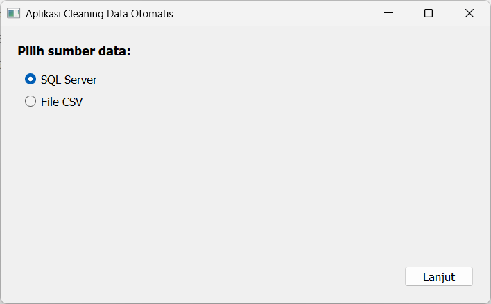

**Halaman Cleaning — Pilih Jenis & Jalankan**

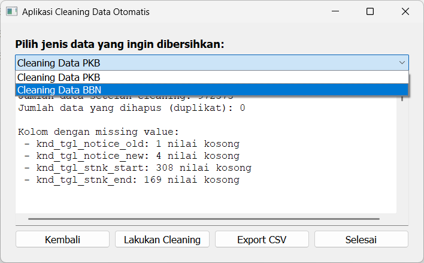

---

## Dashboard PKB — Pajak Kendaraan Bermotor (2020-2024)

Dashboard Power BI interaktif yang memantau pendapatan PKB tahunan, tingkat kepatuhan 
pembayaran, tren musiman, distribusi regional, dan profil demografis pemilik kendaraan 
di seluruh Kabupaten/Kota di NTB.

**Dimensi visualisasi per halaman:** Total PKB, jumlah kendaraan, perbandingan tepat 
waktu vs. menunggak, persentase per kabupaten, kepatuhan berdasarkan profesi, kepatuhan 
berdasarkan jenis kendaraan, tren pembayaran per bulan.

---

**Tahun 2020** · Rp 432M · 856.203 unit
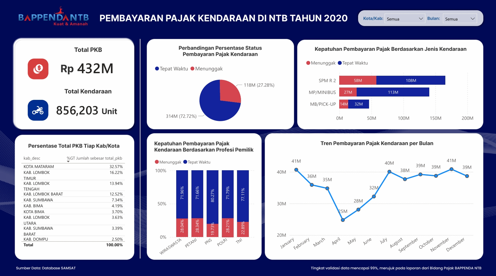
Total penerimaan PKB sebesar Rp 432 miliar dari 856.203 kendaraan. Tingkat menunggak 
cukup tinggi (27,28%), terutama pada sepeda motor (SPM R 2) dan pemilik berprofesi 
petani. Kontribusi terbesar dari Kota Mataram (32,57%), terendah dari Kabupaten Dompu 
(2,50%). Puncak pembayaran terjadi pada Januari dan Maret (masing-masing Rp 41 miliar).

---

**Tahun 2021** · Rp 462M · 865.899 unit
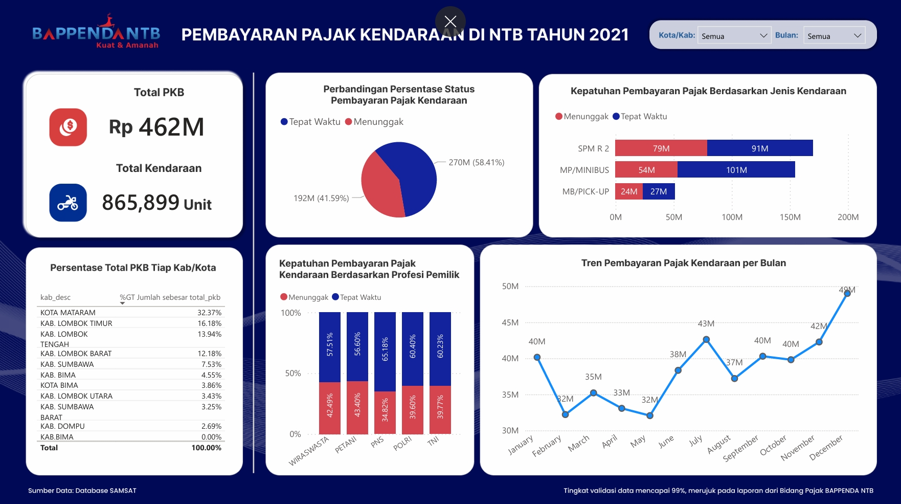
Penerimaan meningkat 7% menjadi Rp 462 miliar. Tingkat menunggak melonjak signifikan 
menjadi 41,59% — mengindikasikan dampak pasca-pandemi COVID-19 terhadap kemampuan bayar 
masyarakat. PNS mencatat kepatuhan tertinggi (65,18%), sementara petani memiliki tingkat 
menunggak tertinggi (43,40%).

---

**Tahun 2022** · Rp 513M · 919.505 unit
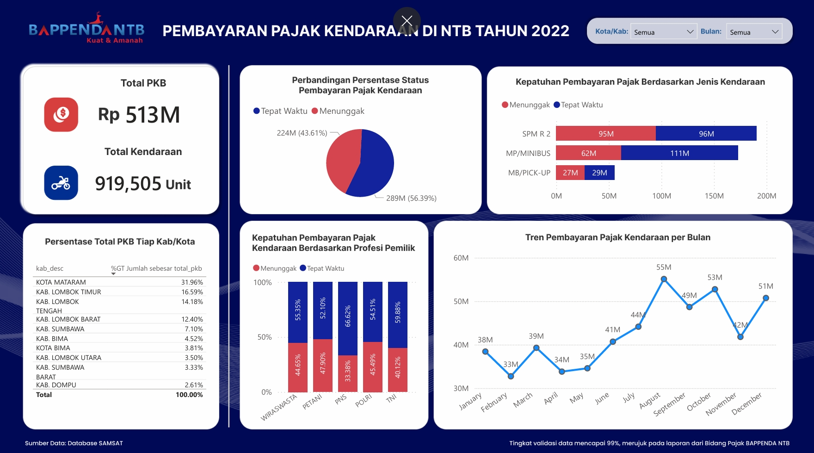
Penerimaan tumbuh 11% menjadi Rp 513 miliar. Tingkat menunggak masih tinggi (43,61%). 
Puncak pembayaran bergeser ke September–November, berbeda dari pola tahun sebelumnya, 
kemungkinan dipengaruhi kebijakan pemutihan pajak.

---

**Tahun 2023** · Rp 544M · 930.853 unit
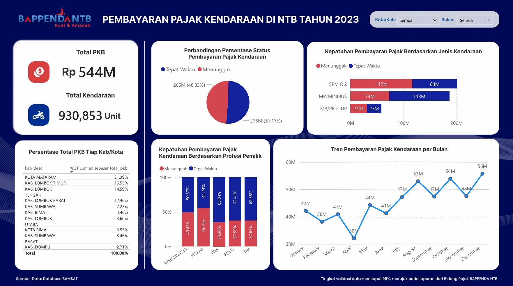
Penerimaan mencapai Rp 544 miliar. Rasio tepat waktu vs. menunggak mendekati 51:49. 
Lonjakan pembayaran terjadi di Q4 (September–Desember), konsisten dengan periode jatuh 
tempo STNK akhir tahun.

---

**Tahun 2024** · Rp 575M · 972.575 unit
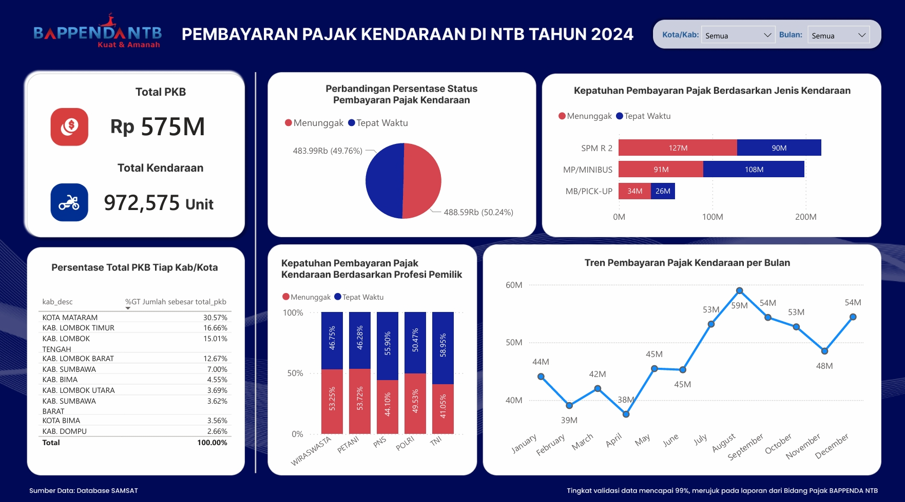
Penerimaan tertinggi dalam 5 tahun, mencapai Rp 575 miliar dari 972.575 unit kendaraan. 
Rasio kepatuhan hampir seimbang (50,24% vs. 49,76%), mengindikasikan tantangan kepatuhan 
yang persisten dan peluang intensifikasi kebijakan penegakan pajak.

---

## Dashboard BBN — Bea Balik Nama Kendaraan Bermotor (2020-2024)

Dashboard Power BI interaktif untuk analisis pendapatan BBN, mencakup aktivitas transfer kendaraan, kontribusi regional, distribusi gender pemilik, pola profesi, dan tren bulanan.
---

**Tahun 2020** · Rp 282M · 90.214 unit
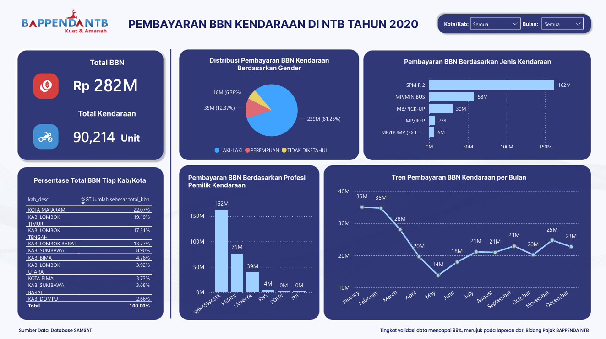
Total BBN sebesar Rp 282 miliar dari 90.214 kendaraan yang berpindah tangan. Dominasi pemilik laki-laki mencapai 81,25%. Wiraswasta menjadi profesi dengan kontribusi terbesar (Rp 162 miliar). Puncak transfer terjadi di Januari dan Februari (Rp 35 miliar), dengan penurunan tajam di pertengahan tahun.

---

**Tahun 2021** · Rp 319M · 97.504 unit
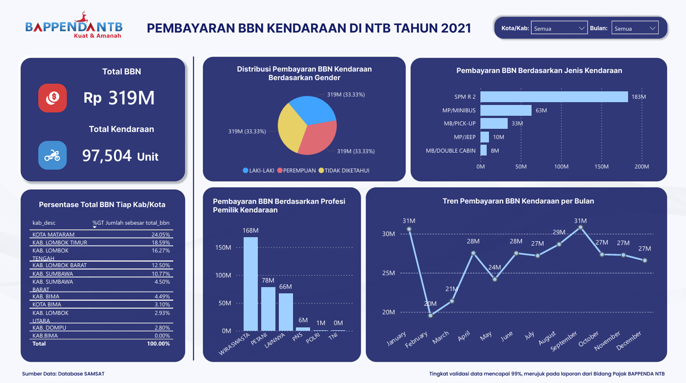
Penerimaan BBN meningkat 13% menjadi Rp 319 miliar. Distribusi gender menunjukkan data tidak tersegmentasi sepenuhnya (33,33% per kategori), mengindikasikan adanya isu kualitas data pada kolom `kd_sex` di tahun ini. Tren bulanan lebih stabil dibanding 2020 (Rp 20M–31M per bulan).

---

**Tahun 2022** · Rp 354M · 97.562 unit
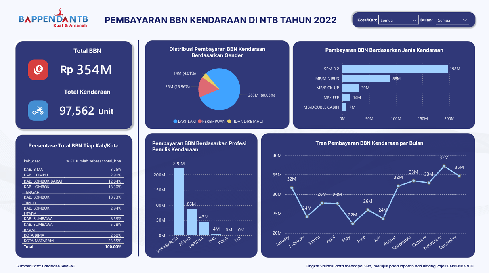
Penerimaan tumbuh 11% menjadi Rp 354 miliar. Dominasi laki-laki kembali terdata dengan baik (80,03%). Kota Mataram tetap menjadi kontributor terbesar (23,55%), diikuti Kabupaten Lombok Timur (18,73%) dan Lombok Tengah (18,30%).

---

**Tahun 2023** · Rp 435M · 123.204 unit
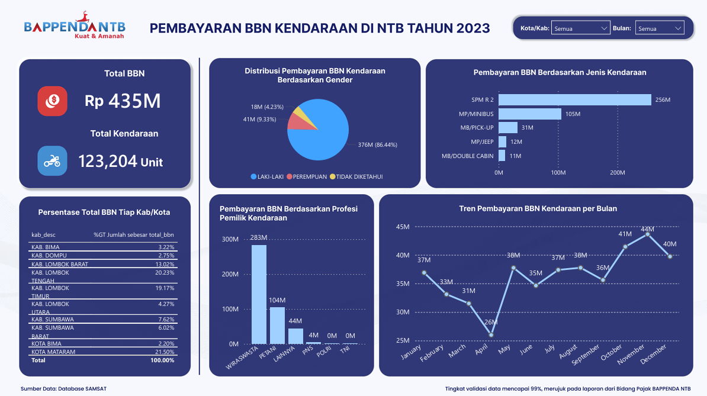
Lonjakan signifikan — penerimaan naik 23% menjadi Rp 435 miliar dengan jumlah kendaraan meningkat ke 123.204 unit. Kemungkinan didorong oleh kebijakan insentif atau pemutihan BBN. Dominasi laki-laki meningkat ke 86,44%. Wiraswasta mendominasi dengan Rp 283 miliar.

---

**Tahun 2024** · Rp 504M · 145.118 unit
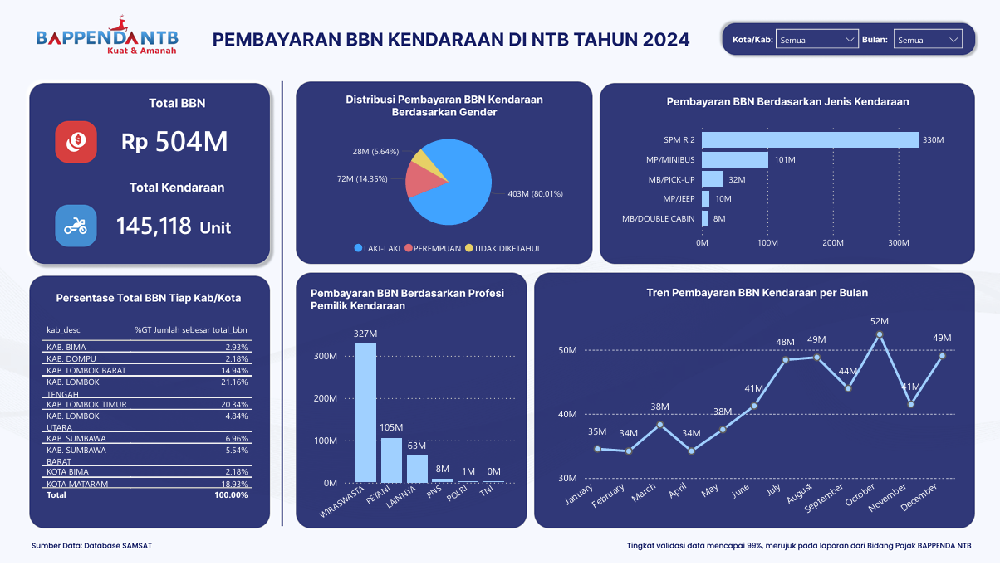
Rekor tertinggi BBN dalam 5 tahun, yaitu Rp 504 miliar dari 145.118 unit. Pertumbuhan konsisten baik dari sisi nilai maupun volume. Dominasi SPM R 2 tetap kuat (Rp 330 miliar), mencerminkan karakteristik kepemilikan kendaraan di NTB yang didominasi sepeda motor.

---

## Struktur Data Sampel

File `data/sample_raw_dummy.csv` mereplikasi skema data asli secara lengkap dengan nilai yang sepenuhnya dianonimkan.

| Kolom | Tipe | Keterangan |
|---|---|---|
| `row_id` | int | ID baris transaksi |
| `kd_drive` | UUID | ID kendaraan — dianonimkan |
| `knd_id` | UUID | ID kendaraan di sistem — dianonimkan |
| `ntc_tb_pkb_p` | float | Pokok PKB yang harus dibayar |
| `ntc_tb_pkb_d` | float | Denda PKB |
| `ntc_tb_bbn1_p` | float | Pokok BBN 1 |
| `ntc_tb_bbn1_d` | float | Denda BBN 1 |
| `ntc_tb_bbn2_p` | float | Pokok BBN 2 |
| `ntc_tb_bbn2_d` | float | Denda BBN 2 |
| `bnk_tanggal` | date | Tanggal pembayaran |
| `ctk_notice_tanggal` | date | Tanggal cetak notice |
| `knd_tgl_notice_old/new` | date | Jatuh tempo lama/baru |
| `knd_tgl_stnk_start/end` | date | Masa berlaku STNK |
| `knd_nopol` | str | Nomor polisi kendaraan — dianonimkan |
| `kab_desc` | str | Kabupaten/Kota |
| `kec_desc` | str | Kecamatan |
| `jns_desc` | str | Jenis kendaraan (SPM R 2, MP/MINIBUS, dll.) |
| `mrk_desc` | str | Merek kendaraan |
| `ntc_dasar_pkb` | float | Nilai Jual Kendaraan Bermotor (NJKB) |
| `kd_sex` | int | Gender pemilik (1=Laki-laki, 0=Perempuan) |
| `job_desc` | str | Profesi pemilik |

---

## Cara Menjalankan

### Prasyarat

```bash
pip install pandas numpy pyodbc PyQt5
```

### 1. Ekstraksi Data

```bash
jupyter notebook 01_data_extraction/getData.ipynb
```

Sesuaikan kredensial SQL Server dan tahun data yang diinginkan di dalam notebook.

### 2. Pembersihan Data

```bash
jupyter notebook 02_data_cleaning/clean_pkb.ipynb
# atau
jupyter notebook 02_data_cleaning/clean_bbn.ipynb
```

Sesuaikan path file CSV input pada sel Load Data.

### 3. Aplikasi Otomasi

Jalankan `03_automation_app/Aplikasi_Cleaning_Data.exe` — tidak memerlukan instalasi Python.

---

## Konteks & Metodologi

Proyek ini dibangun dari nol tanpa pipeline yang sudah ada sebelumnya. Tantangan utama yang dihadapi:

- **Volume data:** 5 juta+ baris per tahun dengan 300+ kolom di database sumber, sehingga diperlukan query terseleksi dan efisien untuk mengambil hanya 28 kolom yang relevan
- **Kualitas data:** Missing values pada kolom tanggal kritis (tanggal notice, STNK), nilai nol ambigu, dan ketidakkonsistenan format — ditangani dengan strategi imputasi berbasis relasi antar-kolom tanggal
- **Performa:** Aplikasi menggunakan arsitektur multi-thread (`QThread`) agar UI tetap responsif saat memproses jutaan baris data
- **Validasi:** Hasil analisis divalidasi silang dengan rekapan tahunan Bidang Pajak Daerah BAPPENDA NTB, mencapai tingkat akurasi 99%
- **Aksesibilitas:** Aplikasi desktop dikembangkan agar staf non-teknis dapat menjalankan pipeline secara mandiri

---

*Dibuat oleh [Dhinda Tsamara Shalsabilla](https://linkedin.com/in/dhinda-tsamara-shalsabilla) · [github.com/dhindatsamara](https://github.com/dhindatsamara)*
